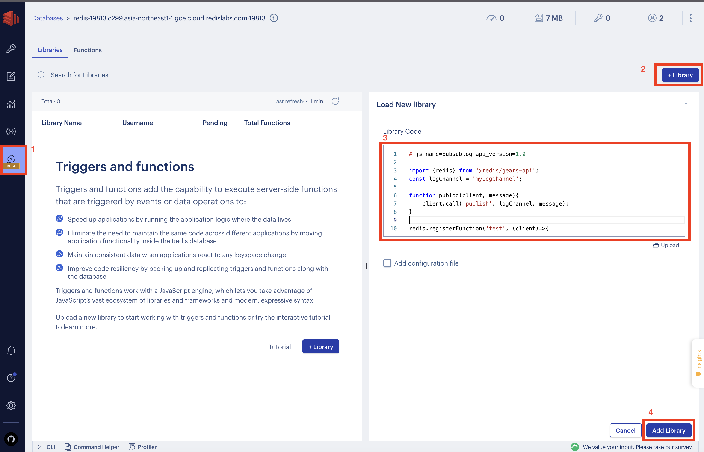
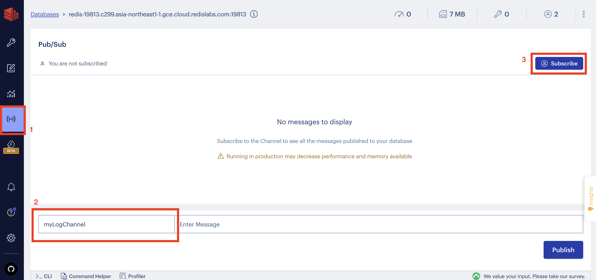
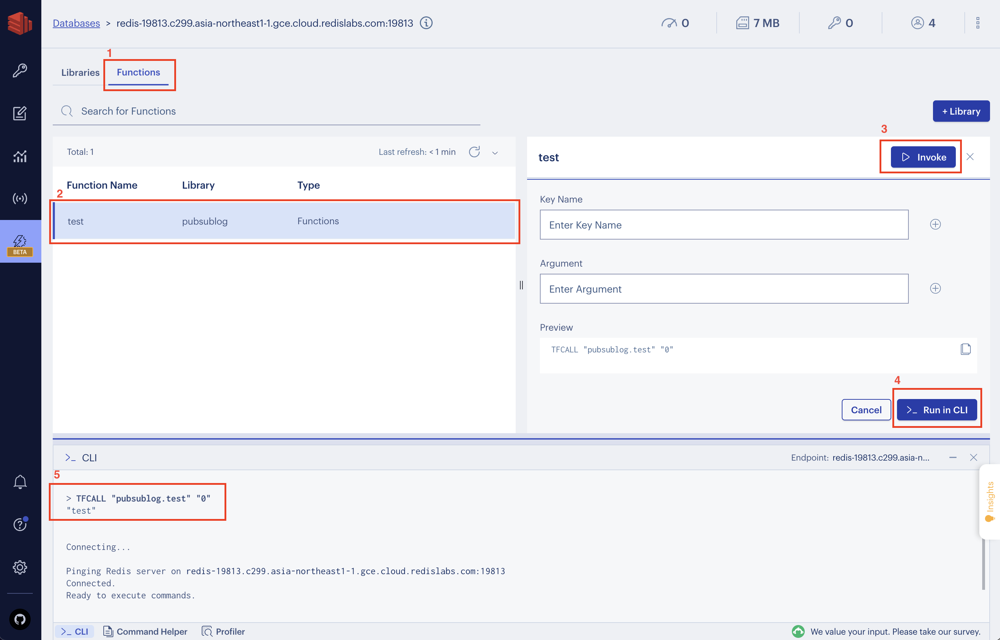
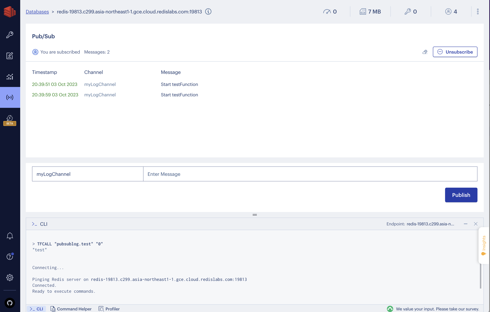

# functions-pubsublog
Example on of how to use pubsub to provide logging for Redis Cloud deployments.

## Run the example

Run `npm install` to use the Triggers and Functions SDK.

```bash
> npm install
```

Update the `package.json` with your Redis connection details.

```JavaScript
"scripts": {
  "deploy": "gears-api index.js -r redis://{user}:{password}@{host}:{port}"
}
```

Load the library your Redis database with Triggers and Functions enabled.

```bash
> npm run deploy
```

Use the redis-cli to connect to your Redis database and `subscribe` to the channel to see log messages come in.

```bash
> redis-cli -h {host} -p {port}
{host}:{port}> subscribe myLogChannel
Reading messages... (press Ctrl-C to quit)
1) "subscribe"
2) "myLogChannel"
3) (integer) 1
```

Call the test function to create a log message.

```bash
{host}:{port} > TFCALL pubsublog.test 0
"test"
```

The following message will be added to the `myLogChannel` pubsub channel:

```bash
1) "message"
2) "myLogChannel"
3) "Start testFunction"
```

## Overview

Use the call method on the client object to publish a message to a pubsub channel.

```JavaScript

const logChannel = 'myLogChannel';

function publog(client, message){
    client.call('publish', logChannel, message);
}
```

The method can then be used from different functions and registrations to log to the same pubsub channel.

```JavaScript
redis.registerFunction('test', (client)=>{
    publog(client, 'Start testFunction');
    return 'test';
});
```

## Using RedisInsight

Connect with RedisInsight to a database with the Triggers and Functions capabilities.



1. Select the Triggers and Functions screen in RedisInsight.
2. Select '+library'.
3. Add the below code in the library code section.
4. Select 'Add library'

```JavaScript
#!js name=pubsublog api_version=1.0

const logChannel = 'myLogChannel';

function publog(client, message){
    client.call('publish', logChannel, message);
}

redis.registerFunction('test', (client)=>{
    publog(client, 'Start testFunction');
    return 'test';
});
```



1. Select the 'Pub/Sub' tab.
2. Add the 'myLogChannel' channel name.
3. Select 'subscribe'.



Go back to the Triggers and Functions tab.
1. Select the Functions submenu.
2. Select the test function we added.
3. Select 'Invoke'.
4. Select '>_ Run in CLI' without adding any arguments or keys.
5. The Result will be shown in the CLI, we expect to see the "test" output.



Go back to the Pub/Sub tab.
The log output is now shown with the timestamp, channel and the message.